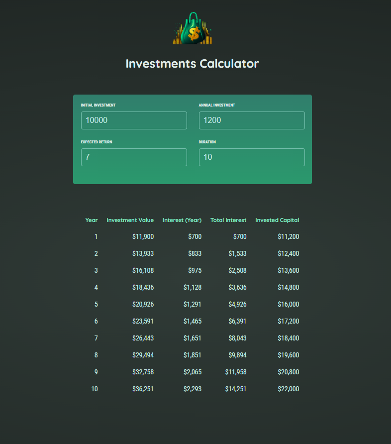

# 💰 Investments Calculator

A simple investment calculator built with **React + Vite** during the [React course by Maximilian Schwarzmüller on Udemy](https://www.udemy.com/course/react-the-complete-guide-incl-redux/).

This app lets users simulate the growth of an investment over time, based on customizable input values.

---

### 📸 Preview



---

### ✨ Features

- Input fields for:
  - 💵 Initial Investment
  - 📈 Annual Investment
  - 📊 Expected Return (%)
  - 🕒 Duration in years
- Dynamic table displaying:
  - Yearly investment value
  - Interest earned
  - Total interest over time
  - Invested capital
- Cumulative interest calculation using `.reduce()`
- Responsive layout and clean UI

---

### ⚙️ Tech Stack

- ⚛️ React
- 🧪 useState, controlled inputs, props lifting
- 🔄 Array methods (`map`, `reduce`, `slice`)
- 💨 Vite for fast development setup
- 💅 Tailored styling with modern CSS

---

### 🛠️ Getting Started

```bash
git clone https://github.com/scurenza/Investments-Calculator-React.git
cd Investments-Calculator-React
npm install
npm run dev
```
Then open http://localhost:5173 in your browser.

---

📚 What I Practiced
React fundamentals

Form handling & two-way binding

Component composition

Dynamic rendering and conditionals

Clean and modular code structure

---

📎 Project Link
🔗 [GitHub Repository](https://github.com/scurenza/Investments-Calculator-React)

---

🧠 Credits
Made by Federico Chiarenza
Based on the course by Maximilian Schwarzmüller on Udemy

---

📝 License
MIT – feel free to use, modify or improve!
